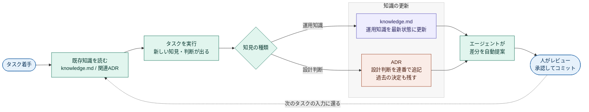

# AI-Driven Engineering Playbook

このプロジェクトは、全員がAIエージェントを主体に開発を進め、
その過程で得た知識を自動でリポジトリに積み上げていく体制で動いている。
このドキュメントは、新しく参加したあなたがその体制に乗るためのガイド。

対象は **このプロジェクトに関わる全員**。このプロジェクトを実装する全員がAIエージェントを
主体として、同じやり方で開発する。それによって、誰が書いたかに関係なく知識が1か所に集まり、
チーム全体の資産になる。

ルールやテンプレートは Claude Code を前提に書かれているが、使うエージェントは Claude に
固定しない。クライアント側がどのエージェントを使っているかは分からないので、`AGENTS.md` を
`CLAUDE.md` へのsymlinkにするオプション(後述)で、Codex など他のエージェントでも同じ知識を
参照できるようにしてある。

## なぜこれをやるのか

これは、エンジニアの三大美徳とされる **怠惰・短気・傲慢** をそのまま体現しながら、
高い生産性とちゃんとしたアウトプットを両立させるための仕組みだ。

- **怠惰 — 自分が楽になる。** 仕様の癖、APIの罠、過去の設計判断 — 調べ直しや
  「前にもハマった気がする」が消える。エージェントが着手前に過去の知見(自分のも他人のも)を
  読んでから作業するので、同じ落とし穴を二度踏まない。同じ仕事を二度やらない。
- **怠惰 — 書く負担がない。** ドキュメントを人間が書いて維持する必要がない。エージェントが
  作業の中で差分を書き、あなたはレビューするだけ。「ドキュメント更新が面倒で放置」が起きない。
- **傲慢 — 属人性から解放される。** 知識が人ではなくリポジトリに残るので、業務委託の出入りや
  クライアント側の引き継ぎがあっても文脈が失われない。「あの人しか知らない」を作らない、
  自分が抜けても回る状態を保つ。
- **短気 — AIの出力が上がる。** 蓄積が厚いほどエージェントがプロジェクトの前提を踏まえた提案を
  する。的外れな出力に苛立つ前に、知識を貯めて使うAIを賢くしておく。貯めるほど自分に返ってくる。

全員が同じやり方で運用するほど、この効果は強くなる。だから「自分のときだけ手で済ませる」より、
この仕組みに乗った方が、結局あなた自身の作業が速く・楽になる。

## 全体像

- 知識ファイルを **書くのはAIエージェント**(Claude Code)。作業の中で自動で更新する。
- **人間がやるのはタスクの着手と、終わったあとのレビュー・承認だけ**。
  どの知識をどこに書くかは考えなくてよい(`CLAUDE.md` の設定でエージェントが自動判断する)。
- エージェントが従う規範はリポジトリルートの `CLAUDE.md` に集約されている。
  このREADMEは、その運用を人間が理解・運用するための解説。
  運用ルール(knowledge.md / ADR の扱い)を変えるときは、規範の `CLAUDE.md` と
  この解説の両方を更新する(同じルールを読者別に書き分けているため)。

知識を中央のドキュメントツールに切り出さず、コードと同じGitリポジトリに置くのが方針。
コードを読むエージェントが知識へ自然に辿り着け、レビューもPRの中で完結する。

## ファイルの場所と役割

| ファイル | 役割 |
|---|---|
| `CLAUDE.md`(ルート直下) | エージェント向けの運用規範。毎セッション読まれる |
| `docs/knowledge.md` | 案件固有の生きた知識 |
| `docs/adr/` | 設計意思決定の記録(ADR)。`0000-template.md` は雛形 |

配置はプロジェクトの構成に合わせて変えてよい。変えた場合の実際のパスは `CLAUDE.md` の
「知識ファイルの場所」に書かれており、エージェントはそれを正として参照する。

### knowledge.md — 案件固有の生きた知識

そのプロジェクトでしか通用しないドメイン知識を蓄積する。

- このクライアントの仕様の癖、業務ルール、用語
- APIや外部システムの制限・ハマりどころ
- デプロイや運用の注意点

**常に最新であってほしい知識** を置く。古くなった記述はAIが上書きして最新化し、履歴は残さない
(履歴はGitが持つ)。コードを読めば分かることや一度きりの作業ログは書かない。

### docs/adr/ — 設計意思決定の記録(ADR)

「なぜその設計を選んだか」を、決定ごとに1ファイル・連番(`0001-xxx.md`, `0002-xxx.md` …)で残す。

- **ADRはエージェントが自走で起こす。** 設計上の意思決定があれば、エージェントが
  ドラフトを書いて差分提案する。人は **PR/差分のレビューで内容を確認** し、
  誤りや早すぎる判断があればコミット前に修正させる。
- **コミット済みのADRは書き換えない。** 決定を覆すときは新しいADRを起こし、
  古いものの Status を `Superseded` にする。これで判断の変遷が辿れる。

### knowledge.md と ADR の使い分け

判断基準は **「将来この決定を覆すとき、過去の理由を残す必要があるか?」**。

| | knowledge.md | ADR |
|---|---|---|
| 性質 | 常に最新化する運用知識 | 時系列で積み上げる意思決定 |
| 古くなったら | 上書きする | 書き換えず Superseded にする |
| 例 | 「このAPIは謎の制限がある」 | 「DBにPostgreSQLを選んだ理由と却下案」 |

## 運用の流れ

**人間がやることは2つだけ。** タスクをエージェントに着手させること、そして終わったあとに
提案された差分をレビューして承認すること。それ以外は何も考えなくてよい。

あいだの知識の蓄積 — 既存の knowledge.md / ADR を読む、得た知見を仕分ける、knowledge.md を
更新する、ADR を起こす、差分を提案する — は **すべて `CLAUDE.md` に書かれた設定に従って
エージェントが自動で行う**。人間が「この知識はどこに書くべきか」「ADRを起こすべきか」を
判断する必要はない。下図の緑のステップはすべて自動で進む。



青があなた(人間)、緑がエージェントの自動処理。あなたは両端の青いステップだけを担当する。
レビューはコミット前に行う(特にADRはコミットすると本文が確定し、以後は書き換えないため)。
書く負担がないので、レビューさえ怠らなければ知識は勝手に貯まり続ける。

## オプション: Codex など他エージェントからも参照する

正本は `CLAUDE.md`。Codex など `AGENTS.md` を読むエージェントも併用したい場合は、
`AGENTS.md` を `CLAUDE.md` へのsymlinkにすると同じ規範で運用できる。基本フローには含めないので、
必要なプロジェクトでだけ実行する。

```bash
# CLAUDE.md を正本として AGENTS.md をsymlinkで同一実体にする
ln -s CLAUDE.md AGENTS.md
```
